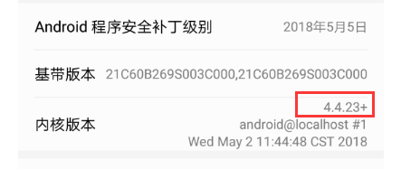
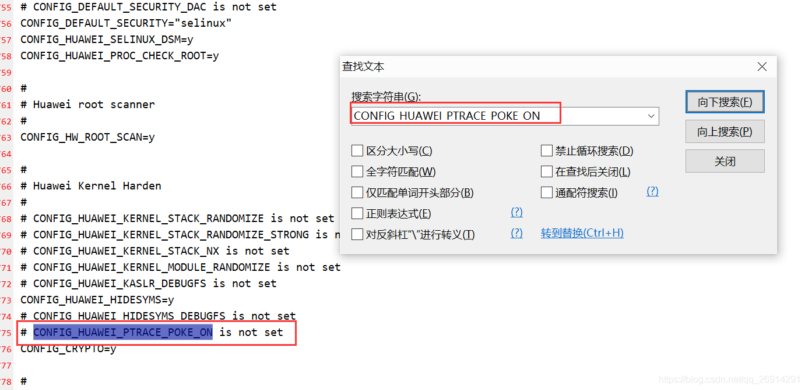
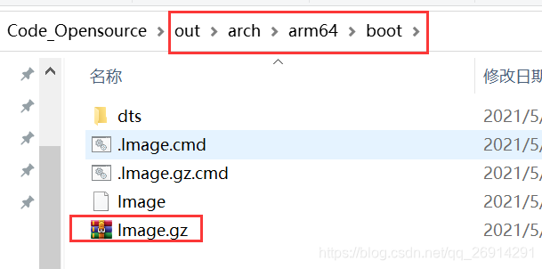
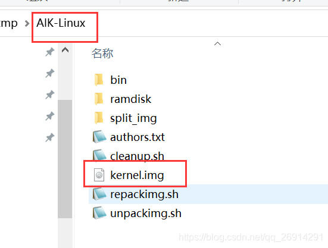
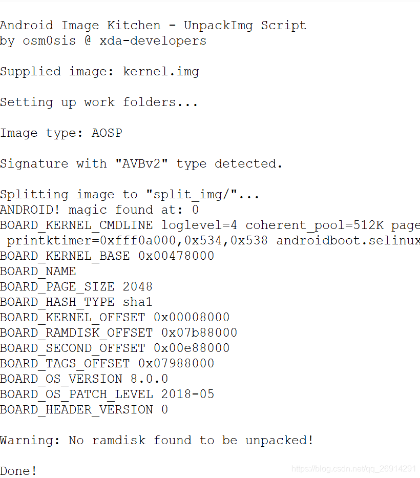
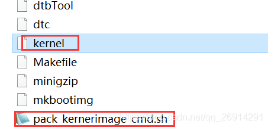
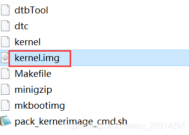

# 【内核定制】超详细华为Honor 9i(LLD-AL20)重新编译内核(解除ptrace禁用)以使用Frida

**目录**

[所需资料](#所需资料)

[详细步骤](#详细步骤)

[检查手机版本](#检查手机版本)

[开启大小写敏感(仅限WSL)](#开启大小写敏感(仅限WSL))

[安装make-3.81(已是该版本可以跳过)](#安装make-3.81(已是该版本可以跳过))

[编译内核](#编译内核)

[制作修补后的内核镜像文件](#制作修补后的内核镜像文件)

[刷入制作的内核镜像文件](#刷入制作的内核镜像文件)

[最终测试 ](#最终测试 )

[最终成品](#最终成品)

[参考](#参考)

------

# 所需资料

1.[LLD-AL20-AL30-L22_OREO_EMUI8.0_Opensource.tar.gz](https://download-c1.huawei.com/download/downloadCenter?downloadId=99912&version=425342&siteCode=worldwide)

2.[android-ndk-r16-beta1-linux-x86_64.zip](https://dl.google.com/android/repository/android-ndk-r16-beta1-linux-x86_64.zip?utm_source=androiddevtools&utm_medium=website)

3.[make-3.81.tar.gz](https://ftp.gnu.org/gnu/make/make-3.81.tar.gz)

4.Linux环境(我这里用的是wsl1)

5.一部华为Honor 9i(LLD-AL20)手机

5.1.已解BL锁

> 注：不能光看界面显示是否解锁，真正是否解锁需要通过：fastboot oem get-lockstate && fastboot oem get-bootinfo && fastboot getvar unlocked && fastboot oem device-info && fastboot oem lock-state info命令判断，否则可能就会出现 FAILED(remote:image verification error) 的错误

5.2.已通过Magisk获取Root权限

5.3.内核版本:4.4.23+

> *注：我刷的包是Honor9i_EMUI8.0_123_8.0.0_18.07.31(精简包).zip，备份地址：\*[Here](https://pan.baidu.com/s/19u_fLvUm3ok1RwI237CS8g?pwd=nxsl)**

6.[AIK-Linux-v3.8-ALL.tar.gz](https://forum.xda-developers.com/attachments/aik-linux-v3-8-all-tar-gz.5300923/)

# 详细步骤

## 检查手机版本

编辑

## 开启大小写敏感(仅限WSL)

*注：Window版本为Win­dows 10 in­sider build 17093及以上*

1.WSL执行命令安装attr

```
sudo apt install attr
```


2.关闭WSL,以管理员运行WSL

3.执行命令开启指定目录的大小写敏感

```
setfattr -n system.wsl_case_sensitive -v 1 "/mnt/f/tmp/"
```


4.执行命令查询指定目录大小写敏感是否开启

```
getfattr -n system.wsl_case_sensitive "/mnt/f/tmp/"
```


## 安装make-3.81(已是该版本可以跳过)

1.解压make-3.81.tar.gz到任意目录

2.进入到该目录，打开glob/glob.c文件修改一个字符('='改成'>=')

编辑

```cpp
# if _GNU_GLOB_INTERFACE_VERSION >= GLOB_INTERFACE_VERSION
```


3.执行命令初始化编译环境

```
./configure
```


4.执行命令以编译

```
./build.sh
```


5.执行命令以安装

```
sudo make install
```


6.执行命令以查看make版本

```
make -v
```


*注：若依然显示以前的版本，则表明make安装失败，可以尝试去掉第2步重新试下*

## 编译内核

1.解压android-ndk-r16-beta1-linux-x86_64.zip的linux-x86_64目录到任意目录

编辑

*注：WSL最好放到上面那个大小写敏感的目录*

2.解压LLD-AL20-AL30-L22_OREO_EMUI8.0_Opensource.tar.gz到任意目录

*注：WSL最好放到上面那个大小写敏感的目录*

3.打开wsl，进入到解压后kernel目录下

4.执行命令配置交叉编译环境

```bash
export PATH=$PATH:/mnt/f/tmp/linux-x86_64/bin
export CROSS_COMPILE=aarch64-linux-android-
```


 5.执行命令创建输出目录

```bash
mkdir ../out
```


X.插入修改步骤

X.1.进入到merge_hi6250_defconfig文件所在目录

编辑

*注：Honor 9i是64位架构,所以我这里选择的是arm64目录*

X.2.在merge_hi6250_defconfig文件查找CONFIG_HUAWEI_PTRACE_POKE_ON，然后修改成CONFIG_HUAWEI_PTRACE_POKE_ON=y

编辑

编辑

6.执行命令1开始编译

```bash
make ARCH=arm64 O=../out merge_hi6250_defconfig
```


 执行成功后输出如下

编辑

7.执行命令2开始编译

```bash
make ARCH=arm64 O=../out -j8
```


 执行成功后输出如下

编辑

8.编译后的文件

编辑

## 制作修补后的内核镜像文件

1.执行adb命令获取内核所在分区

```bash
adb shell ls -l /dev/block/platform/hi_mci.0/by-name/kernel
```


返回

编辑

2.执行adb命令提取内核分区到/sdcard目录下(Root)

```bash
adb shell su -c "dd if=/dev/block/mmcblk0p30 of=/sdcard/kernel.img"
```


成功返回

编辑

3.执行adb命令提取内核镜像文件到电脑端

```bash
adb pull /sdcard/kernel.img
```


 4.解压AIK-Linux-v3.8-ALL.tar.gz到任意目录

*注：WSL最好放到上面那个大小写敏感的目录*

5.将kernel.img文件复制到AIK-Linux目录下

编辑

6.执行命令解包kernel.img以获取其信息

```bash
./unpackimg.sh kernel.img
```


 成功返回信息

编辑

7.根据上面返回信息修改../kernel/tools/pack_kernerimage_cmd.sh对应值（tags_offset,kernel_offset,ramdisk_offset），其他值不用变

```bash
#!/bin/bash
./mkbootimg --kernel kernel --base 0x00400000 --cmdline "loglevel=4 coherent_pool=512K page_tracker=on slub_min_objects=12 unmovable_isolate1=2:192M,3:224M,4:256M printktimer=0xfff0a000,0x534,0x538 androidboot.selinux=enforcing buildvariant=user" --tags_offset 0x07988000 --kernel_offset 0x00080000 --ramdisk_offset 0x07b88000 --os_version 8.0.0 --os_patch_level 2018-05-05  --output kernel.img
```


8.将../out/arch/arm64/boot/Image.gz复制到../kernel/tools/目录下，并改名为kernel

编辑

9.执行命令获取修改后的内核镜像文件

```bash
./pack_kernerimage_cmd.sh
```


执行成功会生成kernel.img文件 

编辑

## 刷入制作的内核镜像文件

1.执行adb命令进入到引导模式

```bash
adb reboot bootloader
```


 2.执行命令刷入制作的内核镜像文件

```bash
fastboot flash kernel kernel.img
```


*注：若是刷入失败，可先尝试下刷提取的原始kernel.img，若依然刷入失败，可依次尝试删除登录账户，关闭屏幕锁等一切锁，关闭查找手机，卸载Magisk(可以稍后再安装)* 

*不过若是刷入原始kernel.img成功，则说明你制作的有问题，请仔细核验。*

*3.执行命令重启到系统*

```bash
fastboot reboot
```


## 最终测试 

经测试可以正常使用Frida进行注入

# 最终成品

[Frida-Honor9i(LLD-AL20)Android8.0.0kernel4.4.23+.img_华为禁止ptrace-系统安全文档类资源-CSDN下载](https://download.csdn.net/download/qq_26914291/18860218)

 或者加入星球《[逆向涉猎](https://t.zsxq.com/071NJKjZb)》获取

# 参考

1.[Win10设置WSL大小写敏感](https://blog.csdn.net/u010164190/article/details/102585879)

2.[WSL 使用中遇到的问题及解决方案 #1 - Windows 文件系统大小写不敏感](https://p3terx.com/archives/problems-and-solutions-encountered-in-wsl-use-1.html)

3.[ 华为内核重新编译踩坑记](https://www.52pojie.cn/thread-1181293-1-1.html)

4.[华为手机重新编译内核开启Ptrace](https://bbs.binmt.cc/forum.php?mod=viewthread&tid=42534)

5.[华为P40内核编译记录](https://blog.seeflower.dev/archives/13/)

6.[Android Kernel 逆向分析准备](https://pkiller.com/android/android-kernel-逆向分析准备/)

7.[华为手机利用fastboot flash recovery_ramdisk **.img刷入的第三方recovery时提示“FAILED(remote:image verification error)”的解决方法](http://www.sunqizheng.com/blog/2285.html) 